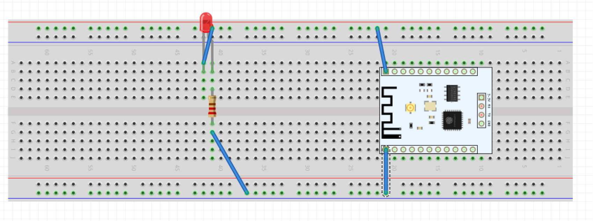

# Projects
May 26 14:55:49 2017
I created this file in VIM, and will update you on what has been done so far.
A few weeks ago, I made a blinking led flashlight with resin.ioOS on a raspberry Pi in the languages of golang(gobots.io) and python(RPi.GPIO)

Today, I got the same thing to work with a NodeMCU esp8266 mounted directly on a breadboard. The circuit diagram is at 

* 
* 
